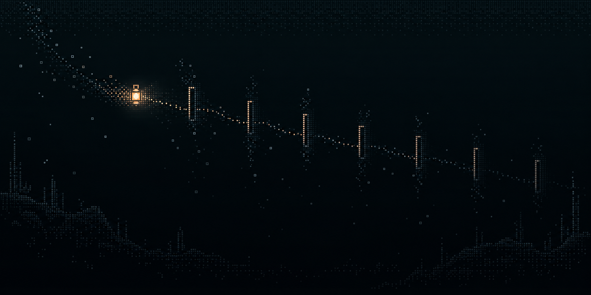
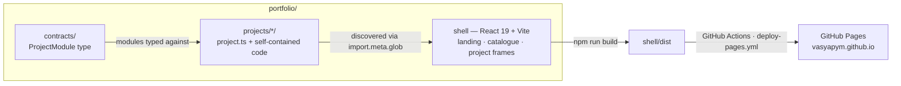

# Vasily Argounov

[](https://github.com/vasyapym/vasyapym.github.io/actions/workflows/deploy-pages.yml)
[](./LICENSE)


Experiments with AI-assisted programming - one React site where every project is an independent module with its own tests.

**Live site: <https://vasyapym.github.io>**

## Contents

- [About](#about)
- [Projects](#projects)
- [Architecture](#architecture)
- [Tech stack](#tech-stack)
- [Run locally](#run-locally)
- [Repository structure](#repository-structure)
- [License](#license)

## About

The shell itself is part of the work. It uses a single "ink catalogue" design system — deep ink `#0b1317`, an ochre accent, Source Sans 3 and IBM Plex Mono — with accessibility treated as a hard rule: `prefers-reduced-motion` fallbacks, WCAG AA contrast, keyboard focus, and touch fallbacks. The landing hero is a custom Canvas 2D "glyph field": a procedural domain-warped fBm heightfield rasterized as monospace glyphs through a DPR-aware glyph atlas, with no WebGL and no animation libraries.

Development is agent-assisted (Claude, GPT, GLM), and every design change is recorded in an append-only decision graph. See [Engineering practice](https://github.com/vasyapym/vasyapym.github.io#engineering-practice).

## Projects

| Project | What it is | Stack | Links |
| --- | --- | --- | --- |
| [Raft Cluster](#raft-cluster) | Crash the leader or cut a link and watch a new term get elected | Rust, WebAssembly, TypeScript, Canvas 2D | [Demo](https://vasyapym.github.io/projects/raft-cluster/) · [Source](https://github.com/vasyapym/vasyapym.github.io/tree/main/portfolio/projects/raft-cluster) |
| [Cat Runner](#cat-runner) | Pastel endless runner with bullet-time dash, ghost replay, and a procedural soundtrack | React Three Fiber, Three.js, TypeScript, deterministic simulation, WebAudio | [Demo](https://vasyapym.github.io/projects/kitty-run/) · [Source](https://github.com/vasyapym/vasyapym.github.io/tree/main/portfolio/projects/kitty-run) |
| [Evening Forest](#evening-forest) | 8-bit first-person walk at dusk with procedural terrain and a custom postprocessing pass | React Three Fiber, Three.js, custom shaders, procedural animation, WebAudio | [Demo](https://vasyapym.github.io/projects/evening-forest/) · [Source](https://github.com/vasyapym/vasyapym.github.io/tree/main/portfolio/projects/evening-forest) |
| [Explosion](#explosion) | Paper-lantern moon that detonates into 600 shards; physics runs on the GPU | React 19, three.js, GPGPU, Rust, WebAudio | [Demo](https://vasyapym.github.io/projects/explosion/) · [Source](https://github.com/vasyapym/vasyapym.github.io/tree/main/portfolio/projects/explosion) |
| [Planck to Now](#planck-to-now) | Scrub cosmic history from the Planck epoch to now on a logarithmic time scale | TypeScript, Three.js, WebGL | [Demo](https://vasyapym.github.io/projects/planck-to-now/) · [Source](https://github.com/vasyapym/vasyapym.github.io/tree/main/portfolio/projects/planck-to-now) |
| [Practice Map](#practice-map) | Sectioned reader, persistent note surface, concept graph, local progress | React, TypeScript, local state | [Demo](https://vasyapym.github.io/projects/practice-map/) · [Source](https://github.com/vasyapym/vasyapym.github.io/tree/main/portfolio/projects/practice-map) |

### Raft Cluster

This is distributed-systems fundamentals applied rather than read about: leader election, term progression, and failure handling run as real code, not a scripted animation.

[Demo](https://vasyapym.github.io/projects/raft-cluster/) · [Source](https://github.com/vasyapym/vasyapym.github.io/tree/main/portfolio/projects/raft-cluster)

### Cat Runner

The simulation is deterministic, which is what makes the ghost replay possible; the audio is generated at runtime with WebAudio.

[Demo](https://vasyapym.github.io/projects/kitty-run/) · [Source](https://github.com/vasyapym/vasyapym.github.io/tree/main/portfolio/projects/kitty-run)

### Evening Forest

A custom postprocessing pass (dusk grade, Bayer dither, posterize) runs over a low-resolution pixelated canvas, and the ambience is synthesized. Instancing and a low internal resolution keep it at 60 fps.

[Demo](https://vasyapym.github.io/projects/evening-forest/) · [Source](https://github.com/vasyapym/vasyapym.github.io/tree/main/portfolio/projects/evening-forest)

### Explosion

The shard physics runs in fragment shaders on the GPU (GPGPU), backed by a Rust/WASM physics core.

[Demo](https://vasyapym.github.io/projects/explosion/) · [Source](https://github.com/vasyapym/vasyapym.github.io/tree/main/portfolio/projects/explosion)

### Planck to Now

Scrub cosmic history — from the Planck epoch to now — on a logarithmic time scale, from the first hot particles to the cosmic web.

[Demo](https://vasyapym.github.io/projects/planck-to-now/) · [Source](https://github.com/vasyapym/vasyapym.github.io/tree/main/portfolio/projects/planck-to-now)

### Practice Map

Progress and notes live in localStorage; there is no account. A concept graph maps the curriculum's vocabulary across topics.

[Demo](https://vasyapym.github.io/projects/practice-map/) · [Source](https://github.com/vasyapym/vasyapym.github.io/tree/main/portfolio/projects/practice-map)

## Architecture



`portfolio/contracts/project-module.ts` defines the `ProjectModule` type. Each project exports a `project.ts` that self-describes — id, title, tag, technologies, artwork, and a lazy `loadPage` — and the shell discovers every module through `import.meta.glob`, so adding a project means adding a directory, not editing the shell. The shell renders the landing catalogue and per-project frames from that metadata and only loads a project's code when its page is opened. The repository is an npm workspace; compiled `.wasm` binaries for the two Rust crates are committed, so a plain Node install is enough to run everything, and wasm-pack rebuilds are optional.

## Tech stack

### Rendering & UI


Three.js via React Three Fiber for the 3D projects; Canvas 2D for the Raft view and the landing glyph field; WebAudio for procedural music and synthesized ambience.

### Languages & build


TypeScript throughout the shell and projects; Rust for the two compute cores; Vite 7 builds; npm workspaces keep each project independently testable.

### Systems & compute


Two Rust crates (Raft, Explosion physics) compiled to WebAssembly with wasm-pack; GPU-side particle physics in fragment shaders.

### Tooling & practice


CI builds and deploys on push to `main` (Node 22, `npm ci`, build, Pages deploy); there is no test step in CI yet.

## Run locally

```bash
npm --prefix portfolio install
npm --prefix portfolio run dev
```

Open `http://localhost:5173` and pick a project. Compiled WebAssembly binaries are committed, so only Node is required; rebuilding the Rust cores is optional (wasm-pack).

Every project carries its own tests. The Raft core runs `cargo test` inside `portfolio/projects/raft-cluster/core`; the rest are plain-Node check scripts under `portfolio/projects/<id>/tests/` (for example `node --experimental-strip-types tests/kitty-run.check.ts`), plus `npm --prefix portfolio run typecheck && npm --prefix portfolio run build` for the shell.

## Repository structure

```text
portfolio/
├── contracts/            shared ProjectModule contract
├── projects/             six self-contained projects (each ships project.ts)
│   ├── raft-cluster/     Raft consensus — Rust core → WASM + Canvas 2D view
│   ├── explosion/        GPGPU shard physics — Rust core → WASM + three.js view
│   ├── kitty-run/        deterministic endless runner (React Three Fiber)
│   ├── evening-forest/   8-bit first-person walk (React Three Fiber)
│   ├── planck-to-now/    log-time cosmology sim (Three.js)
│   └── practice-map/     technical practice map (React)
├── shell/                landing, catalogue, project frames, design system
skills/                   agent-skills plugin (engineering + productivity buckets)
docs/                     design handoffs, ADRs, agent docs
scripts/                  project-graph history tool
.github/workflows/        deploy-pages.yml — build and deploy to GitHub Pages
```

## License

MIT — see [LICENSE](./LICENSE). The bundled skills plugin is also MIT-licensed — see [skills/LICENSE](./skills/LICENSE).

---

**Vasily Argounov** · [vasyapym@gmail.com](mailto:vasyapym@gmail.com)
