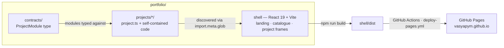

# Vasily Argounov — Engineering Portfolio

[](https://github.com/vasyapym/vasyapym.github.io/actions/workflows/deploy-pages.yml)
[](./LICENSE)


Six self-contained interactive systems — a distributed-consensus simulator, GPU physics, two games, a cosmology scrubber, and a learning tool — shipped as one React site where every project is an independent module with its own tests.

**Live site: <https://vasyapym.github.io>**

## Contents

- [About](#about)
- [Projects](#projects)
- [Architecture](#architecture)
- [Tech stack](#tech-stack)
- [Engineering practice](#engineering-practice)
- [Run locally](#run-locally)
- [Repository structure](#repository-structure)
- [License](#license)

## About

I built this repository to show working systems rather than descriptions of them. Each project is a complete, runnable piece of engineering: a Raft state machine written in Rust and compiled to WebAssembly, GPU-side physics in fragment shaders, a deterministic game simulation with ghost replays, a real-time 3D scene tuned to hold 60 fps, a logarithmic-time cosmology model, and a content-heavy learning tool. They live in one Vite/React shell, but each one is isolated behind a typed module contract and carries its own tests.

The shell itself is part of the work. It uses a single "ink catalogue" design system — deep ink `#0b1317`, an ochre accent, Source Sans 3 and IBM Plex Mono — with accessibility treated as a hard rule: `prefers-reduced-motion` fallbacks, WCAG AA contrast, keyboard focus, and touch fallbacks. The landing hero is a custom Canvas 2D "glyph field": a procedural domain-warped fBm heightfield rasterized as monospace glyphs through a DPR-aware glyph atlas, with no WebGL and no animation libraries.

Development is agent-assisted (Claude Code plus an open-source skills plugin), and every design change is recorded in an append-only decision graph. See [Engineering practice](#engineering-practice).

## Projects

| Project | What it is | Stack | Links |
| --- | --- | --- | --- |
| [Raft Cluster](#raft-cluster) | Live Raft consensus in the browser; crash the leader or cut a link and watch a new term get elected | Rust, WebAssembly, TypeScript, Canvas 2D | [Demo](https://vasyapym.github.io/projects/raft-cluster/) · [Source](https://github.com/vasyapym/vasyapym.github.io/tree/main/portfolio/projects/raft-cluster) |
| [Cat Runner](#cat-runner) | Pastel endless runner with bullet-time dash, ghost replay, and a procedural soundtrack | React Three Fiber, Three.js, TypeScript, deterministic simulation, WebAudio | [Demo](https://vasyapym.github.io/projects/kitty-run/) · [Source](https://github.com/vasyapym/vasyapym.github.io/tree/main/portfolio/projects/kitty-run) |
| [Evening Forest](#evening-forest) | 8-bit first-person walk at dusk with procedural terrain and a custom postprocessing pass | React Three Fiber, Three.js, custom shaders, procedural animation, WebAudio | [Demo](https://vasyapym.github.io/projects/evening-forest/) · [Source](https://github.com/vasyapym/vasyapym.github.io/tree/main/portfolio/projects/evening-forest) |
| [Explosion](#explosion) | Paper-lantern moon that detonates into 600 shards; physics runs on the GPU | React 19, three.js, GPGPU, Rust, WebAudio | [Demo](https://vasyapym.github.io/projects/explosion/) · [Source](https://github.com/vasyapym/vasyapym.github.io/tree/main/portfolio/projects/explosion) |
| [Planck to Now](#planck-to-now) | Scrub cosmic history from the Planck epoch to now on a logarithmic time scale | TypeScript, Three.js, WebGL | [Demo](https://vasyapym.github.io/projects/planck-to-now/) · [Source](https://github.com/vasyapym/vasyapym.github.io/tree/main/portfolio/projects/planck-to-now) |
| [Practice Map](#practice-map) | Working map for technical practice: concept routes, exercises, deep lessons, review-note export | React, TypeScript, local state | [Demo](https://vasyapym.github.io/projects/practice-map/) · [Source](https://github.com/vasyapym/vasyapym.github.io/tree/main/portfolio/projects/practice-map) |

### Raft Cluster

A full Raft state machine written in Rust, compiled to WebAssembly, and visualized with Canvas 2D. You can crash the leader or cut a network link and watch the cluster elect a new term in real time. This is distributed-systems fundamentals applied rather than read about: leader election, term progression, and failure handling run as real code, not a scripted animation.

[Demo](https://vasyapym.github.io/projects/raft-cluster/) · [Source](https://github.com/vasyapym/vasyapym.github.io/tree/main/portfolio/projects/raft-cluster)

### Cat Runner

A pastel endless runner with a bullet-time dash, a ghost replay of your best run, and a procedural soundtrack that plays along — mixer sliders, layered SFX, and a crossfading score built around a kitty motif. The simulation is deterministic, which is what makes the ghost replay possible; the audio is generated at runtime with WebAudio. It demonstrates deterministic game simulation and procedural audio.

[Demo](https://vasyapym.github.io/projects/kitty-run/) · [Source](https://github.com/vasyapym/vasyapym.github.io/tree/main/portfolio/projects/kitty-run)

### Evening Forest

An 8-bit first-person stroll at dusk — no missions, just the walk. Terrain, foliage, and fireflies are procedural. A custom postprocessing pass (dusk grade, Bayer dither, posterize) runs over a low-resolution pixelated canvas, and the ambience is synthesized. Instancing and a low internal resolution keep it at 60 fps. It demonstrates real-time 3D performance engineering.

[Demo](https://vasyapym.github.io/projects/evening-forest/) · [Source](https://github.com/vasyapym/vasyapym.github.io/tree/main/portfolio/projects/evening-forest)

### Explosion

A paper-lantern moon that detonates into the 600 shards it is built from. The shard physics runs in fragment shaders on the GPU (GPGPU), backed by a Rust/WASM physics core. Click to blast, click to restore. It demonstrates GPU-compute thinking: moving per-particle state and integration into textures and shader passes instead of the CPU.

[Demo](https://vasyapym.github.io/projects/explosion/) · [Source](https://github.com/vasyapym/vasyapym.github.io/tree/main/portfolio/projects/explosion)

### Planck to Now

Scrub cosmic history — from the Planck epoch to now — on a logarithmic time scale, from the first hot particles to the cosmic web. It ships a standalone build alongside the embedded one. It demonstrates numerical and scale handling across dozens of orders of magnitude in time, plus presentation polish.

[Demo](https://vasyapym.github.io/projects/planck-to-now/) · [Source](https://github.com/vasyapym/vasyapym.github.io/tree/main/portfolio/projects/planck-to-now)

### Practice Map

A quiet working map for technical practice: concept routes, small exercises, deep lessons (authored essays of roughly 5,000 words each), and review-note export. Progress lives in localStorage; there is no account. It demonstrates product thinking and content engineering — structuring a large body of authored material so it stays navigable and useful.

[Demo](https://vasyapym.github.io/projects/practice-map/) · [Source](https://github.com/vasyapym/vasyapym.github.io/tree/main/portfolio/projects/practice-map)

## Architecture



`portfolio/contracts/project-module.ts` defines the `ProjectModule` type. Each project exports a `project.ts` that self-describes — id, title, tag, technologies, artwork, and a lazy `loadPage` — and the shell discovers every module through `import.meta.glob`, so adding a project means adding a directory, not editing the shell. The shell renders the landing catalogue and per-project frames from that metadata and only loads a project's code when its page is opened. The repository is an npm workspace; compiled `.wasm` binaries for the two Rust crates are committed, so a plain Node install is enough to run everything, and wasm-pack rebuilds are optional.

## Tech stack

### Rendering & UI


Three.js via React Three Fiber for the 3D projects; Canvas 2D for the Raft view and the landing glyph field; WebAudio for procedural music and synthesized ambience.

### Languages & build


TypeScript throughout the shell and projects; Rust for the two compute cores; Vite 7 builds; npm workspaces keep each project independently testable.

### Systems & compute


Two Rust crates (Raft, Explosion physics) compiled to WebAssembly with wasm-pack; GPU-side particle physics in fragment shaders.

### Tooling & practice


CI builds and deploys on push to `main` (Node 22, `npm ci`, build, Pages deploy); there is no test step in CI yet. Development is agent-assisted with Claude Code and the skills plugin described below.

## Engineering practice

I work agent-assisted: Claude Code running on top of the open-source Matt Pocock skills plugin (MIT), which lives in `skills/` in two buckets — engineering and productivity. Design changes go through an append-only decision graph rather than ad-hoc edits. The complete history is in [`docs/portfolio-redesign-handoff.md`](./docs/portfolio-redesign-handoff.md): 28 documented design passes, each with liked/rejected reasoning, quality gates, and verification evidence (typecheck, build, and headless-browser probes at 1440, 1024, and 390 px). A separate append-only project history log (`.project-history/graph.jsonl`, maintained by the tool in `scripts/`) records iterations and handoffs between sessions.

The skills below are what the agent and I actually use. User-invoked skills are triggered by me; model-invoked skills are ones the agent can reach on its own.

### User-invoked (human-only)

| Skill | What it does |
| --- | --- |
| [ask-matt](./skills/engineering/ask-matt/SKILL.md) | Ask which skill or flow fits your situation; a router over the user-invoked skills. |
| [grill-with-docs](./skills/engineering/grill-with-docs/SKILL.md) | Grilling session that also builds the project's domain model (CONTEXT.md + ADRs). |
| [triage](./skills/engineering/triage/SKILL.md) | Move issues through a state machine of triage roles. |
| [improve-codebase-architecture](./skills/engineering/improve-codebase-architecture/SKILL.md) | Scan for deepening opportunities, present as a visual report, grill through the pick. |
| [setup-matt-pocock-skills](./skills/engineering/setup-matt-pocock-skills/SKILL.md) | Configure a repo for the engineering skills. |
| [to-spec](./skills/engineering/to-spec/SKILL.md) | Turn a conversation into a spec and publish it to the issue tracker. |
| [to-tickets](./skills/engineering/to-tickets/SKILL.md) | Break a plan into tracer-bullet tickets with blocking edges. |
| [implement](./skills/engineering/implement/SKILL.md) | Build a spec or tickets, driving TDD at pre-agreed seams. |
| [wayfinder](./skills/engineering/wayfinder/SKILL.md) | Plan work larger than one session as a map of decision tickets. |
| [brainstorm](./skills/productivity/brainstorm/SKILL.md) | Inspect the full diff, propose high-leverage improvements without editing. |
| [design-planning](./skills/productivity/design-planning/SKILL.md) | Compare two design directions, settle the choice before code. |
| [grill-me](./skills/productivity/grill-me/SKILL.md) | Relentless interview about a plan until every branch is resolved. |
| [handoff](./skills/productivity/handoff/SKILL.md) | Compact a conversation into a handoff document for another agent. |
| [teach](./skills/productivity/teach/SKILL.md) | Teach a skill across sessions in a stateful workspace. |
| [to-questionnaire](./skills/productivity/to-questionnaire/SKILL.md) | Turn an unanswerable decision into a questionnaire. |
| [wait-what](./skills/productivity/wait-what/SKILL.md) | Re-pitch a message that didn't land, with missing context. |

### Model-invoked (agent-reachable)

| Skill | What it does |
| --- | --- |
| [prototype](./skills/engineering/prototype/SKILL.md) | Throwaway prototype to answer a design question. |
| [diagnosing-bugs](./skills/engineering/diagnosing-bugs/SKILL.md) | Disciplined diagnosis loop: feedback loop → minimise → hypothesise → instrument → fix. |
| [research](./skills/engineering/research/SKILL.md) | Investigate against primary sources; capture a cited Markdown file. |
| [tdd](./skills/engineering/tdd/SKILL.md) | Red-green-refactor, one vertical slice at a time. |
| [domain-modeling](./skills/engineering/domain-modeling/SKILL.md) | Build and sharpen the domain model; update CONTEXT.md and ADRs. |
| [codebase-design](./skills/engineering/codebase-design/SKILL.md) | Deep-module discipline: small interfaces, clean seams, testable. |
| [code-review](./skills/engineering/code-review/SKILL.md) | Two-axis review (standards + spec) as parallel sub-agents. |
| [resolving-merge-conflicts](./skills/engineering/resolving-merge-conflicts/SKILL.md) | Resolve merge/rebase conflicts hunk by hunk, by intent. |
| [wizard](./skills/engineering/wizard/SKILL.md) | Interactive bash wizard for human-only provisioning steps. |
| [code-iteration](./skills/productivity/code-iteration/SKILL.md) | Iterate non-trivial changes through planning, passes, verification. |
| [custom-learning](./skills/productivity/custom-learning/SKILL.md) | Learn technologies one proof-of-skill subcard at a time. |
| [design-iteration](./skills/productivity/design-iteration/SKILL.md) | Recreate visual taste from an append-only decision graph. |
| [planning](./skills/productivity/planning/SKILL.md) | Turn an approved direction into a repeatable plan. |
| [grilling](./skills/productivity/grilling/SKILL.md) | Relentless interview about a plan or idea. |
| [writing-for-agents](./skills/productivity/writing-for-agents/SKILL.md) | Writing docs for agents (skills, AGENTS.md/CLAUDE.md). |

## Run locally

```bash
npm --prefix portfolio install
npm --prefix portfolio run dev
```

Open `http://localhost:5173` and pick a project. Compiled WebAssembly binaries are committed, so only Node is required; rebuilding the Rust cores is optional (wasm-pack).

Every project carries its own tests. The Raft core runs `cargo test` inside `portfolio/projects/raft-cluster/core`; the rest are plain-Node check scripts under `portfolio/projects/<id>/tests/` (for example `node --experimental-strip-types tests/kitty-run.check.ts`), plus `npm --prefix portfolio run typecheck && npm --prefix portfolio run build` for the shell.

## Repository structure

```text
portfolio/
├── contracts/            shared ProjectModule contract
├── projects/             six self-contained projects (each ships project.ts)
│   ├── raft-cluster/     Raft consensus — Rust core → WASM + Canvas 2D view
│   ├── explosion/        GPGPU shard physics — Rust core → WASM + three.js view
│   ├── kitty-run/        deterministic endless runner (React Three Fiber)
│   ├── evening-forest/   8-bit first-person walk (React Three Fiber)
│   ├── planck-to-now/    log-time cosmology sim (Three.js)
│   └── practice-map/     technical practice map (React)
├── shell/                landing, catalogue, project frames, design system
skills/                   agent-skills plugin (engineering + productivity buckets)
docs/                     design handoffs, ADRs, agent docs
scripts/                  project-graph history tool
.github/workflows/        deploy-pages.yml — build and deploy to GitHub Pages
```

## License

MIT — see [LICENSE](./LICENSE). The bundled skills plugin is also MIT-licensed — see [skills/LICENSE](./skills/LICENSE).

---

**Vasily Argounov** · [vasyapym@gmail.com](mailto:vasyapym@gmail.com)
