# Portfolio redesign — design handoff

This is the durable design source of truth. Code shows what is implemented; this file records why the direction exists, what the user liked, what was rejected, and what must not be rediscovered by accident.

## Current active handoff — Ink catalogue (2026-08-23, refined 2026-08-24)

**Status:** selected direction after the user named the hero's right-side panel as the design standard (`beneath the surface / 01 / tool — Code Layout / 02 / map — Practice Map`) and asked for that style everywhere plus minimal copy. Refined by Pass 12 into a fully static hero with real identity branding.

### Outcome

Make the whole portfolio read as **one continuous dark field organized by catalogue notation**. The deep-ink base `#0b1317` leaves the hero band and becomes the page surface; every section speaks the beneath-panel language: translucent bordered surfaces, lowercase IBM Plex Mono microcopy, ochre `NN / tag` marks, and thin light rules. Copy shrinks to the essential identification layer.

### Visual system

- **Surface:** full-page deep ink `#0b1317`. The warm concrete field is retired from the landing. Panels use translucent light fills (`rgba(238, 234, 224, 0.045)`) over thin light lines. The caustic sea was retired in Pass 12; the hero band carries the static two-glow ink gradient that used to be its WebGL fallback.
- **Type:** Source Sans 3 for headings and reading text; IBM Plex Mono carries all catalogue notation (wordmark, count, kicker, tags, links, chrome labels). Mono notation is lowercase except the personal name, which reads proper case.
- **Notation:** every project carries a mono tag (`tool`, `map`, `sim`, `test`) on `ProjectModule.tag`; numbers come from list order. The hero panel derives its inline rows (`01 / tool — Code Layout`) from the same data instead of hardcoding two titles.
- **Weight:** ochre `#d39b61` is the accent (tags, kicker, hover); bright ochre `#e8b57c` is the focus ring on ink. Project artwork identities stay untouched inside light-lined frames.
- **Identity:** the landing header is the owner's name and email — `Vasily Argounov | vasyapym@gmail.com` (name links home, email is a mailto link); `<title>` is `Vasily Argounov`; project-frame chrome links back with `← Vasily Argounov`.
- **Copy:** hero keeps only kicker `prototypes`, H1 `A collection of digital experiences`, CTA `Run the models ↓`. Cards keep tag row (number/tag + technologies), title, one-line description, and `open ↗`. No status text while everything is available.

### Experience

- **The hero is fully static on ≥561px** — no shader, no drift, no load-time animation (Pass 12). On phones (≤560px, Pass 19) the hero carries one motion idea: three parallax glow layers behind plain catalogue rows plus a one-time staggered entrance; reduced motion freezes everything. The page's other motion is the project-card reveal-on-scroll.
- Beneath rows keep a static SVG displacement warp; no reduced-motion override is needed because nothing moves.
- WebGL failure is no longer a hero concern — there is no canvas.
- Project-frame chrome is an ink band: back link `← Vasily Argounov`, mono lowercase `{title}` label. Tool interiors keep their functional styling; they receive shortened intros and lose decorative captions.
- Reveal-on-scroll, direct links, keyboard focus, touch fallback, and mobile gutters are unchanged.

### Quality gate

- The page must read as one system: if any section still looks like the old light index, the pass failed.
- Mono notation appears wherever orientation is needed and nowhere as decoration.
- Muted text on ink keeps ≥4.5:1 contrast; focus rings are visible at every viewport.
- A project is still identifiable and openable from its card without artwork interaction.

## Superseded handoff — Refraction sea (2026-08-23)

**Status:** superseded by Ink catalogue after the user picked the beneath-surface panel as the design standard; kept as a graph node.

### Carried into Ink catalogue

- The caustic sea as hero focal element, its pause/fallback behavior, and the "mechanics beneath the surface" framing.
- The dark ink band (now extended full-page), ochre accent, direct copy rules, and fast path to the collection.
- The two-column hero with the translucent beneath panel, warp filter, and drift.

### Superseded

- The rule that the collection below stays a warm concrete field — the user asked for the panel's style across the entire design.
- The hardcoded two-row panel and the stacked row layout (replaced by derived inline rows).

## Superseded handoff — Dark catalogue (2026-08-23)

**Status:** superseded by Refraction sea after the motion-led draft review; kept as a graph node.

### Outcome

Make the portfolio feel **archival, tactile, and quietly technical**, with an original catalogue plate carrying the dark hero. Superseded because the plate was static: the user asked for an advanced animated focal element, and the motion drafts showed the dark mood survives without the plate.

### Carried into Refraction sea

- The dark ink band limited to the hero, the ochre accent, and the archival "evidence of work" framing.
- Original project-specific geometry instead of copied reference imagery (the beneath panel previews the two real projects).
- Direct copy, the fast path to the collection, and all list/interaction behavior.

## Superseded handoff — Quiet index (2026-08-22)

**Status:** selected direction after comparing ten visual routes; the production homepage now follows the Quiet index treatment.

### Outcome

Make the portfolio feel **quiet, assured, and useful**. It should read as a small collection of real systems, with the project list carrying the identity instead of a large hero scene or a design-review affordance.

### Visual system

- **Surface:** one flat warm-concrete field; no paper texture, radial glow, glass, or soft atmospheric gradient.
- **Type:** `Source Sans 3` for the interface and headings; `IBM Plex Mono` only for source/code content and the artwork's compact marks. Use 400 for reading text, 500 for orientation, and 600 for headings/actions. No expanded tracking, all-caps treatment, italics, or decorative underlines unless the element needs a clear interaction cue.
- **Structure:** projects are flush horizontal slabs separated by rules, not rounded floating cards. The project artwork is a hard-edged framed block inside each slab, with a smaller signal block anchoring the hero.
- **Weight:** use dark ink, firm rules, solid color blocks, and one project-specific accent. Avoid shadows and excessive border radii.
- **Copy:** direct and useful. No lore, journal voice, poetic labels, or metadata that does not help orientation. The landing ends after the project list; do not restore the removed collection/about/footer copy without explicit instruction.

### Experience

- The first viewport says `Small systems` and `Projects that make ideas usable.` before bringing the collection into view quickly.
- The hero has one compact, solid signal block with three connected points and a central marker. It is a quiet compositional anchor, not a story, navigation metaphor, or second information panel.
- The collection is a single ordered project list on desktop and mobile. Each row exposes number, status, title, description, technologies, artwork, and a direct link.
- Code Layout and Practice Map retain distinct artwork because the objects explain different project subjects.
- Project pages use the same type, surface, rule, and control language while preserving their behavior.
- Motion is limited to scroll reveal and a small artwork inspection response. There is no decorative signal pulse; text and layout remain stable.

### Architecture handoff

- `ProjectPresentation` is the project-owned semantic visual contract.
- `ProjectArtwork` is the shared artwork renderer and pointer-inspection module; geometry stays inside its implementation.
- `LandingPage` is the canonical production route. The older spatial prototype remains comparison-only.
- The Go service, project discovery, local Practice Map state, and Code Layout behavior are unchanged.

### Quality gate

- The collection feels materially grounded without becoming a dashboard, terminal, journal, or gallery of generic cards.
- The first viewport establishes the collection and reaches the first project row without a large empty stage.
- Headings are readable at 390px, have deliberate line breaks, and do not dominate the useful content.
- One sans family carries the interface with a restrained 400/500/600 weight system; labels remain sentence case and use normalized tracking and line-height.
- A project can be understood from its title and description without interacting with the artwork.
- Rules, solid blocks, and accents create hierarchy; they do not become decoration.
- Keyboard focus, direct links, mobile gutters, WCAG AA contrast, touch behavior, and `prefers-reduced-motion` remain intact.

## Compact decision graph

The graph is intentionally terse. When a direction is removed, keep its node and add an edge explaining why; never erase the evidence that produced the next direction.

```mermaid


flowchart LR
  A["Assembly field<br/>spatial instruments"] -->|"terminal-like / too much scene"| B["Quiet kinetic studio<br/>paper + serif + orbit"]
  B -->|"try-hard journal / unreadable generic type"| C["Readable signal index<br/>IBM Plex + soft cards"]
  C -->|"compact is good; cards and type lack solidity"| D["Solid field index<br/>Archivo + project slabs"]
  D -->|"keep solidity; typography and copy still noisy"| E["Calm field index<br/>Source Sans 3 + quiet type"]
  E -->|"generic hero; no memorable effect"| F["Selected systems index<br/>source graph + practice route"]
  F -->|"useful signal; too much visual weight for the index"| G["Quiet index<br/>compact signal + calmer hierarchy"]
  G -->|"dark catalogue field liked; copied reference image rejected"| H["Dark catalogue<br/>original project specimen plate"]
  H -->|"plate was static; user wanted an animated focal element"| I["Refraction sea<br/>caustic shader + submerged project rows"]
  I -->|"beneath panel promoted to the standard; full-page ink + copy diet"| J["Ink catalogue<br/>derived tag notation on a full-page ink field"]
  J -->|"square box cluttered phones; user picked layered glows + multi-parallax"| K["Mobile depth field<br/>glow layers + parallax rows on phones"]
```

### Superseded nodes

- **Assembly field** — kept: project-specific objects, meaningful inspection, restrained motion. Rejected: a spatial world becoming the product and terminal/control-panel atmosphere.
- **Quiet kinetic studio** — kept: restraint and a small kinetic cue. Rejected: paper/journal framing, serif display type, poetic voice, and decorative orbit language.
- **Readable signal index** — kept: direct hierarchy, readable body text, systemacity, compactness, and project-specific artwork. Rejected: oversized heading moments, soft rounded cards, and a surface that feels generic or lightweight.
- **Solid field index** — kept: flush project slabs, firm rules, flat concrete field, and hard-edged artwork. Refined: Archivo/IBM Plex role-splitting, residual all-caps metadata, oversized headings, and auxiliary promotional copy.
- **Calm field index** — kept: Source Sans 3, restrained type scale, direct copy, and the flat field. Rejected/refined: a generic hero mark that did not leave a memorable relationship to the projects.
- **Quiet index** — superseded: keeps the solid field and project slabs, reduces the hero to a small three-point signal, removes the review affordance from production, and lets the project list carry more of the identity.
- **Dark catalogue** — superseded: kept the dark archival band, ochre accent, and original project evidence; replaced because the plate was static when the user asked for an animated focal element.
- **Refraction sea** — superseded: kept the caustic sea hero, beneath panel, and dark band; replaced because its two-tone split (dark hero over light collection) broke the consistency the user asked for when naming the panel the design standard.
- **Ink catalogue** — active: extends the ink field across the page, derives catalogue rows from a per-project tag, and reduces copy to the identification layer. Pass 12 refined it into a fully static hero: the caustic sea (carried from Refraction sea) was retired for the public presentation — its static two-glow fallback gradient remains as the hero band's background, and it stays a candidate if a future pass wants an animated focal element back.
- **Mobile depth field** — active, mobile-only refinement of Ink catalogue (Pass 19): on phones (≤560px) the beneath box dissolves into plain catalogue rows over three parallax glow layers with a one-time staggered entrance; Pass 12's static-hero rule now holds for ≥561px only. The 19 unchosen draft treatments remain alternates on `/mobile-hero-directions`.

### Kept alternates (motion round runners-up)

- **Pixel assembly (draft 01)** — liked: bitmap type over the portrait reference, print-born precision. Kept as a candidate for a future type-led pass; not implemented.
- **Darkroom develop (draft 10)** — liked: cursor-as-developer-light reveal, archival trace mood. Kept as a candidate if the sea ever feels too literal; not implemented.

### Persistent decisions

These survive every direction change unless the user explicitly reverses them:

- The primary job is to understand the collection and open a project.
- The interface is English and the copy is plain.
- Character comes from design quality, not lore or visual density.
- Each project owns its semantic visual identity and keeps distinct artwork.
- Interaction is optional enhancement, never the shortest path to understanding.
- Accessibility, mobile usability, reduced motion, and project behavior are non-negotiable.

## Append-only iteration ledger

Every review adds one compact entry. The **Liked** field becomes a constraint; the **Rejected** field becomes a guardrail; the new direction becomes a graph node only when it is materially different. Do not rewrite old entries to make the path look cleaner.

### Pass 4 — Readable signal index / compactness (2026-08-21)

- **Liked:** systemacity, direct hierarchy, readable body type, neutral surface, restrained signal, and more compact composition.
- **Rejected:** journal styling, oversized display type, decorative atmosphere, and generic poetic language.
- **Carried forward:** project-specific artwork, direct project links, stable text, reduced motion, and clear metadata.
- **Result:** compactness improved, but the surface still felt like soft generic cards rather than a solid design system.

### Pass 5 — Solid field index (2026-08-21)

- **Liked:** compactness remains a requirement; the useful content should arrive early.
- **Change:** replace the card catalogue with flush project slabs, firm rules, moderate Archivo headings, a flat concrete field, and hard-edged artwork blocks.
- **Rejected/deferred:** rounded card shells, shadows, soft gradients, oversized headings, decorative signal labels, and a new spatial world.
- **Quality gate:** the collection must feel grounded and specific at rest, with the projects carrying the visual weight instead of the container treatment.
- **Next review:** `/`, `/projects/code-layout`, and `/projects/practice-map` at 1440px, 1024px, and 390px; verify keyboard focus, touch fallback, reduced motion, and real copy lengths.

### Pass 6 — Calm field index / quiet type (2026-08-21)

- **Liked:** the solid field and compact project list remain the right structural direction.
- **Change:** use Source Sans 3 as the single interface/display family, keep mono only where code or compact artwork notation requires it, normalize labels to sentence case, lower the largest heading scales, and remove a redundant center label from the Code Layout artwork.
- **Removed:** the landing-page collection/about/footer block: `About the collection`, `Making is how I learn.`, its explanatory paragraph, `Built while learning in public`, and `More projects incoming`.
- **Rejected/refined:** remaining all-caps labels, expanded tracking, mixed UI type roles, decorative underlines, and typography that competes with the projects.
- **Quality gate:** the interface should feel composed at rest: one type family, three useful weights, consistent text rhythm, no promotional tail, and no heading larger than the content can support.
- **Verification:** `npm run typecheck`, `npm run build`, `go test ./...`, and `git diff --check` pass. Preview checked all three production routes at the available 408px viewport; Source Sans 3 loaded, removed copy is absent, no production all-caps remain, and there is no horizontal overflow or console error.
- **Next review:** `/`, `/projects/code-layout`, and `/projects/practice-map` at 1440px, 1024px, and 390px; verify focus, touch fallback, reduced motion, real copy lengths, and the final font-loaded state.

### Pass 7 — Selected projects / project signals (2026-08-22)

- **Liked:** the calm field, direct project list, and restrained type remain the right base.
- **Change:** make `Selected projects` the hero H1, remove the redundant `Selected projects` eyebrow and the collection heading `A small set of working systems.`, and shorten the intro to `Small systems for testing ideas and seeing what happens next.`
- **Changed figure:** replace the generic square-and-point hero mark with a compact source-structure panel and route graph joined by a central signal. The hero now previews the actual subjects of Code Layout and Practice Map.
- **Rejected:** generic signal geometry with no relationship to the work; the phrase `learning in public` in visible copy and metadata.
- **Quality gate:** the first viewport should identify the collection in one sentence and leave a concrete trace of the projects before the list begins. The figure must read as a source graph and a route, not as an abstract logo.
- **Verification:** `npm --prefix portfolio run typecheck`, `npm --prefix portfolio run build`, `git diff --check`, accessibility snapshot, and mobile preview at 408px pass; the landing has no horizontal overflow and the hero exposes 20 SVG elements for the two project signals.
- **Next review:** test hover/focus response on the project signals and compare the hero balance at 1440px, 1024px, and 390px.

### Pass 8 — Quiet index / calmer hierarchy (2026-08-22)

- **Liked:** the comparison confirmed that the solid field, direct project list, and readable Source Sans 3 system are the strongest foundation.
- **Change:** promote `Quiet index` to production: use `Small systems` and `Projects that make ideas usable.` as the hero statement, replace the large source/route composition with a smaller three-point signal, tighten the project slab rhythm, and remove `Compare directions` from the production header.
- **Rejected/refined:** a large explanatory hero figure, a second review-oriented navigation path in the finished header, oversized project typography, and any treatment that makes the container louder than the work.
- **Quality gate:** the first viewport should feel composed and useful at rest; the hero should establish tone without delaying the first project; project rows should remain readable, distinct, and directly openable.
- **Verification:** `npm run typecheck`, `npm run build`, `git diff --check`, mobile preview at 408px, selection/navigation checks on the comparison route, and no horizontal overflow pass.
- **Next review:** inspect the Quiet index at 1440px, 1024px, and 390px with real project counts and long descriptions; verify keyboard focus, reduced motion, and whether the compact signal still feels specific rather than decorative.

### Pass 9 — Dark catalogue / original project plate (2026-08-23)

- **Liked:** the dark catalogue draft's contrast, archival mood, tactile image weight, and sharper visual point of view.
- **Rejected:** copying or collaging the reference image into the production hero; a photo-led treatment that does not explain the actual projects.
- **Carried forward:** Source Sans 3, direct project list, firm rules, restrained motion, project-specific identity, and a fast path to the collection.
- **Changed:** replace the compact signal block with an original dark catalogue plate containing Code Layout and Practice Map specimen sheets, catalogue notation, a central stitch marker, and small pointer inspection response. Update the hero copy to `Ideas should leave a trace.` and a direct working-prototype description.
- **Quality gate:** the hero must feel dark, archival, and specific without becoming a copied-image collage, terminal, dashboard, or large decorative scene.
- **Next review:** `/`, `/projects/code-layout`, and `/projects/practice-map` at 1440px, 1024px, and 390px; verify keyboard focus, touch fallback, reduced motion, real copy lengths, and the final font-loaded state.
- **Verification:** `npm run typecheck`, `npm run build`, and `git diff --check` pass; the compiled Dark catalogue hero was visually checked at the available 408px viewport with no horizontal overflow or console errors. The project list remains unchanged and the reduced-motion CSS fallback leaves the catalogue plate stable.

### Pass 10 — Refraction sea / animated focal element (2026-08-23)

- **Liked:** from the motion draft round — the caustic shader sea (draft 02) ranked first, bitmap pixel type (draft 01) second, darkroom reveal (draft 10) third; the dark field, fluid light, and the "mechanics beneath the surface" idea.
- **Rejected:** the catalogue plate's stillness (no animated focal element); repeating a phrase between kicker and subheading; any full-bleed scene that delays the first project.
- **Carried forward:** the dark ink hero band, ochre accent, direct copy rules, project-specific evidence in the hero, fast path to the collection, and all list behavior.
- **Changed:** replace the catalogue plate with a WebGL caustic field (`RefractionField`) behind the hero copy and a translucent beneath-surface panel holding the two project rows under an SVG displacement warp with a slow drift. New hero copy: `Prototypes, not promises` / `See the mechanics before you commit.` / `Every project is a working model that shows how an idea behaves under real use.` CTA: `Run the models ↓`. Meta description updated to match.
- **Quality gate:** the sea must read as an instrument, not a screensaver; copy stays dominant; the shader pauses off-screen and on hidden tabs; reduced motion gets a single frame and frozen drift; WebGL failure falls back to a static gradient; the first project still arrives quickly.
- **Verification:** `npm run typecheck` and `npm run build` pass; routes `/`, `/projects/code-layout`, and `/projects/practice-map` to review at 1440px, 1024px, and 390px with keyboard focus, touch, and reduced-motion checks.
- **Next review:** confirm caustic intensity keeps AA contrast behind the copy at all three viewports; check shader performance on low-power devices; decide whether the beneath panel's warp scale needs tuning.

### Pass 11 — Evening Forest / first-person showcase project (2026-08-23)

- **Liked:** the landing's dark sea hero gains its first fully self-contained 3D showcase; the terrain-motion card language extends naturally to a walking simulator; dusk palette (violet zenith, amber horizon) echoes the ochre accent without competing with it.
- **Rejected:** iframe embedding (bigbang-ts pattern) — R3F mounts natively and stays code-split behind `loadPage`; photo-real rendering — contradicts both the 8-bit brief and the shell's flat archival mood.
- **Carried forward:** project-module discovery contract, per-project semantic identity, reduced-motion and touch fallbacks, no binary assets in the repo.
- **Changed:** added `projects/evening-forest` — an R3F walking sim with procedural terrain/foliage/fireflies, pointer-lock WASD rig, one custom postprocessing effect (dusk grade + Bayer dither + posterize) over a low-DPR pixelated canvas, and synthesised WebAudio ambience. New dependency group in `shell`: `@react-three/fiber`, `@react-three/drei`, `@react-three/postprocessing`, `postprocessing`; `three` raised to ^0.185.1 for peer compatibility. Landing card uses the existing terrain motion with a warm accent block in `styles.css`.
- **Quality gate:** the forest must read as an evening instrument, not a tech demo — copy dominance on the landing card holds, the page keeps 60 fps via instancing + low internal resolution, audio starts only from a user gesture, Esc always returns control, and WebGL/touch/reduced-motion states degrade to honest notices instead of broken canvases.
- **Verification:** `npm --prefix portfolio run typecheck`, `npm run build`, and `node --experimental-strip-types tests/forest.check.ts` pass; `/projects/evening-forest` and `/` reviewed for console errors and focus order at desktop width.
- **Next review:** tune fog density vs draw distance after playtesting; confirm bloom threshold keeps fireflies readable through the posterize pass; consider a mobile drag-look mode if coarse-pointer visits matter.

### Pass 11 — Ink catalogue / beneath-panel standard (2026-08-23)

- **Liked:** the hero's right-side panel — dark translucent surface, lowercase mono microcopy, ochre `01 / tool` notation, thin rules — named by the user as the design standard for the whole portfolio.
- **Rejected:** the two-tone split (dark hero over warm-concrete collection); hardcoded hero rows that ignore the real list; redundant copy (hero intro sentence, card eyebrows, status text while everything is available, duplicated technology lists, decorative captions).
- **Changed:** full-page ink field with new `--ink-*` tokens and an ochre focus ring on dark; wordmark/count/CTA/card links set in mono lowercase; cards restructured to tag row (`NN / tag` + technologies) / title / one-line description / `open ↗`; beneath panel derives inline rows (`01 / tool — Code Layout`) from `ProjectModule.tag` (`tool`, `map`, `sim`, `test`) across all four projects; project-frame chrome becomes an ink band with `← Selected Experiments` and a mono `{title}` label; interiors receive trimmed intros and lose decorative captions; meta description shortened.
- **Quality gate:** the page reads as one catalogue system at rest; mono notation carries orientation without decoration; muted-on-ink text keeps ≥4.5:1 contrast; focus visible on every surface; reveal/warp/drift behavior and reduced-motion fallbacks unchanged; first project still arrives quickly.
- **Verification:** `npm run typecheck`, `npm run build`, and `git diff --check` pass; dev-server smoke test returns 200 for `/` and `/projects/code-layout` with the updated meta description. Visual review of `/` plus `/projects/{code-layout,practice-map,bigbang-ts,explosion_luna}` at 1440px, 1024px, and 390px still to confirm: AA contrast for every light-on-dark pair, font-loaded state, no horizontal overflow, keyboard focus, reduced motion.
- **Next review:** the routes above at three viewports; judge whether the sea's intensity needs lowering now that the surrounding field is also dark.

### Pass 12 — Static ink hero / identity header (2026-08-24)

- **Liked:** the catalogue system at rest — full-page ink, mono notation, beneath panel — remains the right public face; the hero's static two-glow gradient (formerly the WebGL fallback) reads calm and professional.
- **Rejected:** hero motion for a public-facing portfolio (caustic shader animation, beneath-row drift); placeholder branding (`Selected Experiments`, `Prototypes, not promises`) on a personal site.
- **Changed:** landing header reads `Vasily Argounov | vasyapym@gmail.com` — name links home in proper case, email is a mailto link; project-frame back link becomes `← Vasily Argounov`; `<title>` → `Vasily Argounov`; meta description → `Prototypes — see the mechanics before you commit.`; hero kicker shortened to `prototypes`; `RefractionField` deleted and the static two-glow gradient moved onto the hero band background; beneath-row drift animations, their keyframes, their reduced-motion overrides, and the row-a/row-b variants removed. The static SVG displacement warp on the beneath rows stays (no motion).
- **Quality gate:** the page stays one calm catalogue system with zero hero animation at load or at rest; identity readable at 390px without overflow or truncation; muted-on-ink contrast ≥4.5:1 for name/email/count; focus visible on wordmark and email links; card reveal-on-scroll unchanged; comparison-only routes untouched.
- **Verification:** `npm --prefix portfolio run typecheck`, `npm --prefix portfolio run build`, `git diff --check`, and dev-server smoke test pass; see results below.
- **Next review:** `/` plus `/projects/{code-layout,practice-map,bigbang-ts,explosion_luna}` at 1440px, 1024px, and 390px; judge whether the static gradient needs more presence now that the sea is gone, and whether the proper-case name sits well against lowercase mono notation.

### Pass 13 — Hero statement / collection framing (2026-08-24)

- **Rejected:** `See the mechanics before you commit.` as the public hero statement — the user reframed the site as a portfolio of experiences rather than a lab pitch.
- **Changed:** H1 → `A collection of digital experiences`; meta description → `Prototypes — a collection of digital experiences.` Kicker `prototypes` stays.
- **Quality gate:** the first viewport reads as a personal portfolio; copy remains minimal; no other sections touched.
- **Verification:** typecheck, build, and smoke test pass (same session as Pass 12).
- **Next review:** unchanged from Pass 12.

### Pass 14 — Ink interior / Code Layout conversion (2026-08-24)

- **Liked:** the landing's ink catalogue system as the named standard; the tool interior now speaks it end to end.
- **Rejected:** the light blue-era interior (`--index-blue` accents, light surfaces) as a two-tone break inside one ink frame; marketing hero copy — eyebrow, intro paragraph, the `Structure.` display heading, decorative artifact captions.
- **Changed:** `/projects/code-layout` converted to a full-bleed ink field via a `code-layout-field` wrapper (the shared `.project-frame` stays light for the not-yet-converted interiors): translucent `--ink-panel` surfaces, `--ink-line` rules, zero radii, `color-scheme: dark`; all blue → ochre with the bright-ochre focus ring; Analyze button solid ochre with ink text, no hover lift; toolbar labels, footer note, results heading, and insight values set in lowercase mono; artifact plates recolored to the ink/ochre family over the hero's static two-glow gradient. Copy diet: H1 → `Source in. Structure out.`, CTA → `Try it ↓`, `Load sample ↗`, footer → `runs locally · nothing executed`, results heading collapsed to `layout · {language}` with `n lines · x% confidence · copy` meta.
- **Quality gate:** the interior reads as one catalogue system with the frame chrome; muted-on-ink text ≥4.5:1; focus ring visible on every control; form behavior and the Go service untouched.
- **Verification:** `npm --prefix portfolio run typecheck`, `npm --prefix portfolio run build`, `git diff --check`, `go test ./...` (service), dev-server smoke 200 for `/` and `/projects/code-layout`; headless screenshots at 1440/1024/390 — no horizontal overflow, lowercase mono notation, contrast holds. Results state reviewed statically (same token system).
- **Next review:** run a real analysis and review the results section at the three widths; decide whether the planck-to-now and practice-map interiors get the same conversion.

### Pass 15 — Ink interior / Explosion conversion (2026-08-24)

- **Liked:** the ink catalogue system as the named standard; the interior now reads as one catalogue with the frame chrome; payload notation rows echo the beneath panel.
- **Rejected:** the light blue-era interior with rust/red accents as a two-tone break inside one ink frame; marketing copy — eyebrow, intro paragraph, the `A small room for large reactions.` display heading, payload sentences, footer paragraph; uppercase stage notation.
- **Changed:** `/projects/explosion` converted to a full-bleed ink field via an `explosion-field` wrapper (the shared `.project-frame` stays light for the not-yet-converted interiors): `--ink-*` tokens, `color-scheme: dark`, bright-ochre focus ring; stage re-based on the ink gradient keeping its grid overlay and two-glow depth; payload cards → beneath-panel-style mono tag rows (`01 / core` … `04 / spark cloud`); stage heading collapsed to a mono meta row (`live · click or press enter`, switching to `reduced motion · blast disabled`); stage overlay lowercase (`specimen / lx-01`, `nnn impacts`); footer removed. Copy diet: H1 → `Click anywhere. / It breaks.`, CTA → `Detonate ↓`, fallback → `webgl unavailable · specimen sealed`; landing card description → `Every click inside the room detonates at the point of impact.`; card note → `impact test`. Scene behavior and palette in `detonate.ts` untouched.
- **Quality gate:** the interior reads as one catalogue system with the frame chrome; muted-on-ink text ≥4.5:1; focus ring visible on the stage and links; detonation behavior, reduced-motion disable, and WebGL fallback unchanged.
- **Verification:** `npm --prefix portfolio run typecheck`, `npm run build`, and `git diff --check` pass; dev-server smoke returns 200 for `/`, `/projects/explosion`, and `/projects/code-layout` with the identity `<title>`; headless screenshots at 1440/1024/390 show no horizontal overflow, lowercase mono notation, and a coherent fallback state (headless Chrome has no WebGL); landing card shows the shortened description.
- **Next review:** view `/projects/explosion` with WebGL enabled to judge the scene palette against the ink field; decide whether the remaining light interiors (planck-to-now, practice-map, kitty-run) get the same conversion.

### Pass 16 — Ink interior / Planck to Now conversion (2026-08-24)

- **Liked:** the ink catalogue system as the named standard; `/projects/planck-to-now` and the standalone `/planck-to-now/` HUD now read as one catalogue with the frame chrome; the epoch panel echoes the beneath panel and stays legible over the Big-Bang flash.
- **Rejected:** the light blue-era interior (`--index-*` surfaces, rust `#a8652d` eyebrow, blue hover) as a two-tone break inside one ink frame; marketing copy — eyebrow, intro paragraph, `The Big Bang in motion.` display heading, footer link row; HUD decoration — uppercase letterspaced epoch title, italic description, glow text-shadows, blue-white palette.
- **Changed:** project page converted to a full-bleed ink field via a `planck-field` wrapper (the shared `.project-frame` stays light for the not-yet-converted interiors): `--ink-*` tokens, `color-scheme: dark`, bright-ochre focus ring, zero radii, iframe border → `--ink-line`; facts dl → mono notation rows (`01 / runtime — webgl · three.js` … `03 / controls — orbit · zoom · scrub`); simulation heading collapsed to a mono meta row (`live · webgl playback` + `open standalone ↗`); footer removed. Standalone HUD: IBM Plex Mono loaded (preconnect + stylesheet, system mono fallback), ink palette (`#eeeae0` text, ochre `#e8b57c` accent, ochre timeline ramp, ink kbd chips), lowercase epoch, `paused` badge, single `planck-to-now` mark replacing the top-right caption, epoch panel gets the beneath-panel scrim (translucent ink fill + hairline + blur) for contrast over the flash, error copy → `webgl unavailable · simulation sealed` / `webgl context lost — reload to restart.`. Copy diet: H1 → `13.8 billion years. / One scrub.` (ochre second line), CTA → `Open the simulation ↓`; landing card blurb → `Scrub cosmic history — from the Planck epoch to now.` Epoch descriptions in `cosmology.ts` kept — instrument content, per user decision; card artwork and sim logic untouched.
- **Quality gate:** the page and the HUD read as one catalogue system with the frame chrome; muted-on-ink text ≥4.5:1 (the panel scrim covers the flash moment); focus ring visible on every link; iframe/standalone behavior, scrub, playback, and reduced-motion damping unchanged.
- **Verification:** `npm --prefix portfolio run typecheck`, `npm --prefix portfolio run build`, `npm --prefix portfolio/projects/planck-to-now run verify`, and `git diff --check` pass; dev-server smoke returns 200 for `/`, `/projects/planck-to-now`, and `/planck-to-now/`; headless Chrome at 1440/1024/390 — no horizontal overflow on all three routes, `.planck-field` bg `#0b1317` with `color-scheme: dark`, mono facts rows, ochre focus ring on tab, landing card blurb live, HUD legible in flash and dark-space states.
- **Next review:** view `/projects/planck-to-now` mid-playback at the three widths to judge the panel scrim's weight on dark space; decide whether the remaining light interiors (practice-map, kitty-run) get the same conversion.

### Pass 17 — Ink interior / Kitty Run conversion (2026-08-24)

- **Liked:** the ink catalogue system as the named standard; the page now reads as one catalogue with the frame chrome; the pastel game survives as framed artwork inside a hard-edged ink-lined stage, and the menu states read as beneath-panel takeovers over the run.
- **Rejected:** the pastel page chrome (pink field, rounded shadowed stage card, pill buttons, uppercase overlay eyebrows) as a two-tone break inside one ink frame; flavor copy — the header lede, `Pastel endless runner` eyebrow, `Catch your breath`, `Keep running`, `One more run`.
- **Changed:** `/projects/kitty-run` converted to a full-bleed ink field via a `kitty-run-field` wrapper (game modules untouched): `--ink-*` tokens, `color-scheme: dark`, bright-ochre focus ring; stage loses radius/shadow for a 1px `--ink-line` frame; header reduced to H1 + mono `sound on/off` toggle (lede removed); overlay veil → ink, cards → beneath-panel-style with ochre mono kickers (`ready` / `paused` / `run over`), one functional line each (controls / resume keys / `{score} points · best {best}`), solid-ochre single-word action chips (`start` / `resume` / `again`); fallback → `webgl unavailable · run sealed`; attribution trimmed to a lowercase mono line. In-game HUD (hearts, score, combo, pause, floaters, debug) stays pastel over the canvas — the play surface is untouched, per user decision.
- **Quality gate:** page chrome and menu states read as one catalogue system with the frame chrome; muted-on-ink text ≥4.5:1 (hints and attribution use `--ink-muted`); focus ring visible on the mute toggle and cards; game logic, spawn/tuning/score modules, and HUD behavior unchanged.
- **Verification:** `npm --prefix portfolio run typecheck`, `npm --prefix portfolio run build`, `node --experimental-strip-types tests/kitty-run.check.ts`, and `git diff --check` pass; dev-server smoke returns 200 for `/projects/kitty-run`; headless Chrome at 1440/1024/390 — `.kitty-run-field` bg `#0b1317` with `color-scheme: dark`, zero-radius stage with the `--ink-line` border, mono mute/kicker/hint, no horizontal overflow, no console errors; Enter → run → Esc → paused card verified (`paused · p or esc resumes · r restarts · resume`).
- **Next review:** play a full run with WebGL enabled to judge HUD legibility against the ink chrome at the frame edge; decide whether practice-map gets the same conversion (the last light interior).

### Pass 19 — Mobile hero / depth layers (2026-08-24)

- **Liked:** from a 20-variant mobile draft round (`/mobile-hero-directions`, live miniatures at 375–430px) the user picked draft 11 "Depth layers" — three soft glow fields at different parallax depths replacing the square beneath-panel box on phones; the catalogue rows staying as plain notation; calm, GPU-only motion.
- **Rejected:** the hard-bordered 320px beneath box on mobile (read as a square out of place); the 19 unchosen treatments (orb, blob, ring, diamond, aperture, dot matrix, scanline, arc, split stack, chips, dock, line reveal, counter, marquee, magnetic CTA, ripple, tilt, aurora, grain) — recorded as graph-adjacent alternates, not directions; reversing Pass 12's static-hero rule beyond mobile was not requested.
- **Changed:** at ≤560px only — the beneath panel loses border/fill/blur/label/warp rule and renders as plain full-width rows; a `.signal-index-hero-depth` field adds far/mid/near glow layers (teal/ochre/bright-ochre, blur 26px) whose translate is driven by a scroll-progress custom property `--hero-p` (rAF-throttled scroll listener in `LandingPage`, gated by `prefers-reduced-motion` and the 560px query); one-time staggered entrance (kicker → H1 → CTA → rows, layers fade) with explicit `to` keyframes. Desktop and tablet (≥561px) keep the Pass 12 static hero and the boxed panel unchanged.
- **Quality gate:** the mobile hero reads as one ink catalogue with the landing; motion is transform/opacity only and dies under `prefers-reduced-motion` (layers static, no parallax listener, entrances skipped); rows keep ≥44px targets, AA contrast, and focus rings; no horizontal overflow; first project still arrives quickly; desktop pixel-behavior unchanged.
- **Verification:** `npm --prefix portfolio run typecheck` and `npm --prefix portfolio run build` and `git diff --check` pass; headless Chrome on `/` at 390/768/1440 — zero console errors, zero horizontal overflow; at 390px the panel border/fill compute to 0/transparent, label and rule display none, far layer transform moves 0 → −19.2px after a 700px scroll (parallax live); with emulated `prefers-reduced-motion` `--hero-p` stays unset and layers sit at identity; at 768/1440 the panel keeps its 1px border, fill, and label (unchanged).
- **Next review:** `/` at 390/430 with a real device hand — judge glow intensity against sunlight and whether the entrance stagger feels slow; decide whether the 561–900px single-column range should adopt the same treatment.

## Deterministic handoff protocol

1. Read the active direction, persistent decisions, graph, and latest ledger entry before editing.
2. Derive the next pass from the latest **Liked** and **Rejected** fields; do not restart from the code's current appearance alone.
3. Make one coherent visual change and preserve unrelated behavior.
4. Review the fixed routes, viewports, states, and content lengths named by the entry.
5. Append the result before beginning another pass. If a trait is removed, collapse it into a graph node with its reason instead of deleting it.
6. Stop when the quality gate passes. A new aesthetic idea is a new decision and must enter the graph before implementation.

The canonical workflow for this protocol is `/design-iteration`; `/design-planning` and `/planning` remain the lower-level choice and execution-plan skills.
