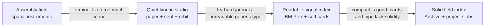

# Portfolio redesign — design handoff

This is the durable design source of truth. Code shows what is implemented; this file records why the direction exists, what the user liked, what was rejected, and what must not be rediscovered by accident.

## Active handoff — Solid field index (2026-08-21)

**Status:** current direction under implementation after the user rejected the soft Readable signal index as visually insubstantial.

### Outcome

Make the portfolio feel **solid, quiet, and intentional**. It should read as a small collection of real systems, not a set of floating marketing cards or a decorative editorial world.

### Visual system

- **Surface:** one flat warm-concrete field; no paper texture, radial glow, glass, or soft atmospheric gradient.
- **Type:** `Archivo` for headings and project names; `IBM Plex Sans` for reading text; `IBM Plex Mono` for short metadata only. Headings are strong but moderate, never viewport-filling.
- **Structure:** projects are flush horizontal slabs separated by rules, not rounded floating cards. The project artwork is a hard-edged framed block inside each slab.
- **Weight:** use dark ink, firm rules, solid color blocks, and one project-specific accent. Avoid shadows and excessive border radii.
- **Copy:** direct and useful. No lore, journal voice, poetic labels, or metadata that does not help orientation.

### Experience

- The first viewport says `Projects for learning by making.` and brings the collection into view quickly.
- The hero has one compact, solid signal block. It is a compositional anchor, not a story or navigation metaphor.
- The collection is a single ordered project list on desktop and mobile. Each row exposes number, status, title, description, technologies, artwork, and a direct link.
- Code Layout and Practice Map retain distinct artwork because the objects explain different project subjects.
- Project pages use the same type, surface, rule, and control language while preserving their behavior.
- Motion is limited to scroll reveal, a small artwork inspection response, and the quiet signal pulse. Text and layout remain stable.

### Architecture handoff

- `ProjectPresentation` is the project-owned semantic visual contract.
- `ProjectArtwork` is the shared artwork renderer and pointer-inspection module; geometry stays inside its implementation.
- `LandingPage` is the canonical production route. The older spatial prototype remains comparison-only.
- The Go service, project discovery, local Practice Map state, and Code Layout behavior are unchanged.

### Quality gate

- The collection feels materially grounded without becoming a dashboard, terminal, journal, or gallery of generic cards.
- The first viewport establishes the collection and reaches the first project row without a large empty stage.
- Headings are readable at 390px, have deliberate line breaks, and do not dominate the useful content.
- A project can be understood from its title and description without interacting with the artwork.
- Rules, solid blocks, and accents create hierarchy; they do not become decoration.
- Keyboard focus, direct links, mobile gutters, WCAG AA contrast, touch behavior, and `prefers-reduced-motion` remain intact.

## Compact decision graph

The graph is intentionally terse. When a direction is removed, keep its node and add an edge explaining why; never erase the evidence that produced the next direction.

### Superseded nodes

- **Assembly field** — kept: project-specific objects, meaningful inspection, restrained motion. Rejected: a spatial world becoming the product and terminal/control-panel atmosphere.
- **Quiet kinetic studio** — kept: restraint and a small kinetic cue. Rejected: paper/journal framing, serif display type, poetic voice, and decorative orbit language.
- **Readable signal index** — kept: direct hierarchy, readable body text, systemacity, compactness, and project-specific artwork. Rejected: oversized heading moments, soft rounded cards, and a surface that feels generic or lightweight.

### Persistent decisions

These survive every direction change unless the user explicitly reverses them:

- The primary job is to understand the collection and open a project.
- The interface is English and the copy is plain.
- Character comes from design quality, not lore or visual density.
- Each project owns its semantic visual identity and keeps distinct artwork.
- Interaction is optional enhancement, never the shortest path to understanding.
- Accessibility, mobile usability, reduced motion, and project behavior are non-negotiable.

## Append-only iteration ledger

Every review adds one compact entry. The **Liked** field becomes a constraint; the **Rejected** field becomes a guardrail; the new direction becomes a graph node only when it is materially different. Do not rewrite old entries to make the path look cleaner.

### Pass 4 — Readable signal index / compactness (2026-08-21)

- **Liked:** systemacity, direct hierarchy, readable body type, neutral surface, restrained signal, and more compact composition.
- **Rejected:** journal styling, oversized display type, decorative atmosphere, and generic poetic language.
- **Carried forward:** project-specific artwork, direct project links, stable text, reduced motion, and clear metadata.
- **Result:** compactness improved, but the surface still felt like soft generic cards rather than a solid design system.

### Pass 5 — Solid field index (2026-08-21)

- **Liked:** compactness remains a requirement; the useful content should arrive early.
- **Change:** replace the card catalogue with flush project slabs, firm rules, moderate Archivo headings, a flat concrete field, and hard-edged artwork blocks.
- **Rejected/deferred:** rounded card shells, shadows, soft gradients, oversized headings, decorative signal labels, and a new spatial world.
- **Quality gate:** the collection must feel grounded and specific at rest, with the projects carrying the visual weight instead of the container treatment.
- **Next review:** `/`, `/projects/code-layout`, and `/projects/practice-map` at 1440px, 1024px, and 390px; verify keyboard focus, touch fallback, reduced motion, and real copy lengths.

## Deterministic handoff protocol

1. Read the active direction, persistent decisions, graph, and latest ledger entry before editing.
2. Derive the next pass from the latest **Liked** and **Rejected** fields; do not restart from the code's current appearance alone.
3. Make one coherent visual change and preserve unrelated behavior.
4. Review the fixed routes, viewports, states, and content lengths named by the entry.
5. Append the result before beginning another pass. If a trait is removed, collapse it into a graph node with its reason instead of deleting it.
6. Stop when the quality gate passes. A new aesthetic idea is a new decision and must enter the graph before implementation.

The canonical workflow for this protocol is `/design-iteration`; `/design-planning` and `/planning` remain the lower-level choice and execution-plan skills.
