# Portfolio redesign — design handoff

This is the durable design source of truth. Code shows what is implemented; this file records why the direction exists, what the user liked, what was rejected, and what must not be rediscovered by accident.

## Active handoff — Quiet index (2026-08-22)

**Status:** selected direction after comparing ten visual routes; the production homepage now follows the Quiet index treatment.

### Outcome

Make the portfolio feel **quiet, assured, and useful**. It should read as a small collection of real systems, with the project list carrying the identity instead of a large hero scene or a design-review affordance.

### Visual system

- **Surface:** one flat warm-concrete field; no paper texture, radial glow, glass, or soft atmospheric gradient.
- **Type:** `Source Sans 3` for the interface and headings; `IBM Plex Mono` only for source/code content and the artwork's compact marks. Use 400 for reading text, 500 for orientation, and 600 for headings/actions. No expanded tracking, all-caps treatment, italics, or decorative underlines unless the element needs a clear interaction cue.
- **Structure:** projects are flush horizontal slabs separated by rules, not rounded floating cards. The project artwork is a hard-edged framed block inside each slab, with a smaller signal block anchoring the hero.
- **Weight:** use dark ink, firm rules, solid color blocks, and one project-specific accent. Avoid shadows and excessive border radii.
- **Copy:** direct and useful. No lore, journal voice, poetic labels, or metadata that does not help orientation. The landing ends after the project list; do not restore the removed collection/about/footer copy without explicit instruction.

### Experience

- The first viewport says `Small systems` and `Projects that make ideas usable.` before bringing the collection into view quickly.
- The hero has one compact, solid signal block with three connected points and a central marker. It is a quiet compositional anchor, not a story, navigation metaphor, or second information panel.
- The collection is a single ordered project list on desktop and mobile. Each row exposes number, status, title, description, technologies, artwork, and a direct link.
- Code Layout and Practice Map retain distinct artwork because the objects explain different project subjects.
- Project pages use the same type, surface, rule, and control language while preserving their behavior.
- Motion is limited to scroll reveal and a small artwork inspection response. There is no decorative signal pulse; text and layout remain stable.

### Architecture handoff

- `ProjectPresentation` is the project-owned semantic visual contract.
- `ProjectArtwork` is the shared artwork renderer and pointer-inspection module; geometry stays inside its implementation.
- `LandingPage` is the canonical production route. The older spatial prototype remains comparison-only.
- The Go service, project discovery, local Practice Map state, and Code Layout behavior are unchanged.

### Quality gate

- The collection feels materially grounded without becoming a dashboard, terminal, journal, or gallery of generic cards.
- The first viewport establishes the collection and reaches the first project row without a large empty stage.
- Headings are readable at 390px, have deliberate line breaks, and do not dominate the useful content.
- One sans family carries the interface with a restrained 400/500/600 weight system; labels remain sentence case and use normalized tracking and line-height.
- A project can be understood from its title and description without interacting with the artwork.
- Rules, solid blocks, and accents create hierarchy; they do not become decoration.
- Keyboard focus, direct links, mobile gutters, WCAG AA contrast, touch behavior, and `prefers-reduced-motion` remain intact.

## Compact decision graph

The graph is intentionally terse. When a direction is removed, keep its node and add an edge explaining why; never erase the evidence that produced the next direction.

```mermaid
flowchart LR
  A["Assembly field<br/>spatial instruments"] -->|"terminal-like / too much scene"| B["Quiet kinetic studio<br/>paper + serif + orbit"]
  B -->|"try-hard journal / unreadable generic type"| C["Readable signal index<br/>IBM Plex + soft cards"]
  C -->|"compact is good; cards and type lack solidity"| D["Solid field index<br/>Archivo + project slabs"]
  D -->|"keep solidity; typography and copy still noisy"| E["Calm field index<br/>Source Sans 3 + quiet type"]
  E -->|"generic hero; no memorable effect"| F["Selected systems index<br/>source graph + practice route"]
  F -->|"useful signal; too much visual weight for the index"| G["Quiet index<br/>compact signal + calmer hierarchy"]
```

### Superseded nodes

- **Assembly field** — kept: project-specific objects, meaningful inspection, restrained motion. Rejected: a spatial world becoming the product and terminal/control-panel atmosphere.
- **Quiet kinetic studio** — kept: restraint and a small kinetic cue. Rejected: paper/journal framing, serif display type, poetic voice, and decorative orbit language.
- **Readable signal index** — kept: direct hierarchy, readable body text, systemacity, compactness, and project-specific artwork. Rejected: oversized heading moments, soft rounded cards, and a surface that feels generic or lightweight.
- **Solid field index** — kept: flush project slabs, firm rules, flat concrete field, and hard-edged artwork. Refined: Archivo/IBM Plex role-splitting, residual all-caps metadata, oversized headings, and auxiliary promotional copy.
- **Calm field index** — kept: Source Sans 3, restrained type scale, direct copy, and the flat field. Rejected/refined: a generic hero mark that did not leave a memorable relationship to the projects.
- **Quiet index** — active: keeps the solid field and project slabs, reduces the hero to a small three-point signal, removes the review affordance from production, and lets the project list carry more of the identity.

### Persistent decisions

These survive every direction change unless the user explicitly reverses them:

- The primary job is to understand the collection and open a project.
- The interface is English and the copy is plain.
- Character comes from design quality, not lore or visual density.
- Each project owns its semantic visual identity and keeps distinct artwork.
- Interaction is optional enhancement, never the shortest path to understanding.
- Accessibility, mobile usability, reduced motion, and project behavior are non-negotiable.

## Append-only iteration ledger

Every review adds one compact entry. The **Liked** field becomes a constraint; the **Rejected** field becomes a guardrail; the new direction becomes a graph node only when it is materially different. Do not rewrite old entries to make the path look cleaner.

### Pass 4 — Readable signal index / compactness (2026-08-21)

- **Liked:** systemacity, direct hierarchy, readable body type, neutral surface, restrained signal, and more compact composition.
- **Rejected:** journal styling, oversized display type, decorative atmosphere, and generic poetic language.
- **Carried forward:** project-specific artwork, direct project links, stable text, reduced motion, and clear metadata.
- **Result:** compactness improved, but the surface still felt like soft generic cards rather than a solid design system.

### Pass 5 — Solid field index (2026-08-21)

- **Liked:** compactness remains a requirement; the useful content should arrive early.
- **Change:** replace the card catalogue with flush project slabs, firm rules, moderate Archivo headings, a flat concrete field, and hard-edged artwork blocks.
- **Rejected/deferred:** rounded card shells, shadows, soft gradients, oversized headings, decorative signal labels, and a new spatial world.
- **Quality gate:** the collection must feel grounded and specific at rest, with the projects carrying the visual weight instead of the container treatment.
- **Next review:** `/`, `/projects/code-layout`, and `/projects/practice-map` at 1440px, 1024px, and 390px; verify keyboard focus, touch fallback, reduced motion, and real copy lengths.

### Pass 6 — Calm field index / quiet type (2026-08-21)

- **Liked:** the solid field and compact project list remain the right structural direction.
- **Change:** use Source Sans 3 as the single interface/display family, keep mono only where code or compact artwork notation requires it, normalize labels to sentence case, lower the largest heading scales, and remove a redundant center label from the Code Layout artwork.
- **Removed:** the landing-page collection/about/footer block: `About the collection`, `Making is how I learn.`, its explanatory paragraph, `Built while learning in public`, and `More projects incoming`.
- **Rejected/refined:** remaining all-caps labels, expanded tracking, mixed UI type roles, decorative underlines, and typography that competes with the projects.
- **Quality gate:** the interface should feel composed at rest: one type family, three useful weights, consistent text rhythm, no promotional tail, and no heading larger than the content can support.
- **Verification:** `npm run typecheck`, `npm run build`, `go test ./...`, and `git diff --check` pass. Preview checked all three production routes at the available 408px viewport; Source Sans 3 loaded, removed copy is absent, no production all-caps remain, and there is no horizontal overflow or console error.
- **Next review:** `/`, `/projects/code-layout`, and `/projects/practice-map` at 1440px, 1024px, and 390px; verify focus, touch fallback, reduced motion, real copy lengths, and the final font-loaded state.

### Pass 7 — Selected projects / project signals (2026-08-22)

- **Liked:** the calm field, direct project list, and restrained type remain the right base.
- **Change:** make `Selected projects` the hero H1, remove the redundant `Selected projects` eyebrow and the collection heading `A small set of working systems.`, and shorten the intro to `Small systems for testing ideas and seeing what happens next.`
- **Changed figure:** replace the generic square-and-point hero mark with a compact source-structure panel and route graph joined by a central signal. The hero now previews the actual subjects of Code Layout and Practice Map.
- **Rejected:** generic signal geometry with no relationship to the work; the phrase `learning in public` in visible copy and metadata.
- **Quality gate:** the first viewport should identify the collection in one sentence and leave a concrete trace of the projects before the list begins. The figure must read as a source graph and a route, not as an abstract logo.
- **Verification:** `npm --prefix portfolio run typecheck`, `npm --prefix portfolio run build`, `git diff --check`, accessibility snapshot, and mobile preview at 408px pass; the landing has no horizontal overflow and the hero exposes 20 SVG elements for the two project signals.
- **Next review:** test hover/focus response on the project signals and compare the hero balance at 1440px, 1024px, and 390px.

### Pass 8 — Quiet index / calmer hierarchy (2026-08-22)

- **Liked:** the comparison confirmed that the solid field, direct project list, and readable Source Sans 3 system are the strongest foundation.
- **Change:** promote `Quiet index` to production: use `Small systems` and `Projects that make ideas usable.` as the hero statement, replace the large source/route composition with a smaller three-point signal, tighten the project slab rhythm, and remove `Compare directions` from the production header.
- **Rejected/refined:** a large explanatory hero figure, a second review-oriented navigation path in the finished header, oversized project typography, and any treatment that makes the container louder than the work.
- **Quality gate:** the first viewport should feel composed and useful at rest; the hero should establish tone without delaying the first project; project rows should remain readable, distinct, and directly openable.
- **Verification:** `npm run typecheck`, `npm run build`, `git diff --check`, mobile preview at 408px, selection/navigation checks on the comparison route, and no horizontal overflow pass.
- **Next review:** inspect the Quiet index at 1440px, 1024px, and 390px with real project counts and long descriptions; verify keyboard focus, reduced motion, and whether the compact signal still feels specific rather than decorative.

## Deterministic handoff protocol

1. Read the active direction, persistent decisions, graph, and latest ledger entry before editing.
2. Derive the next pass from the latest **Liked** and **Rejected** fields; do not restart from the code's current appearance alone.
3. Make one coherent visual change and preserve unrelated behavior.
4. Review the fixed routes, viewports, states, and content lengths named by the entry.
5. Append the result before beginning another pass. If a trait is removed, collapse it into a graph node with its reason instead of deleting it.
6. Stop when the quality gate passes. A new aesthetic idea is a new decision and must enter the graph before implementation.

The canonical workflow for this protocol is `/design-iteration`; `/design-planning` and `/planning` remain the lower-level choice and execution-plan skills.
